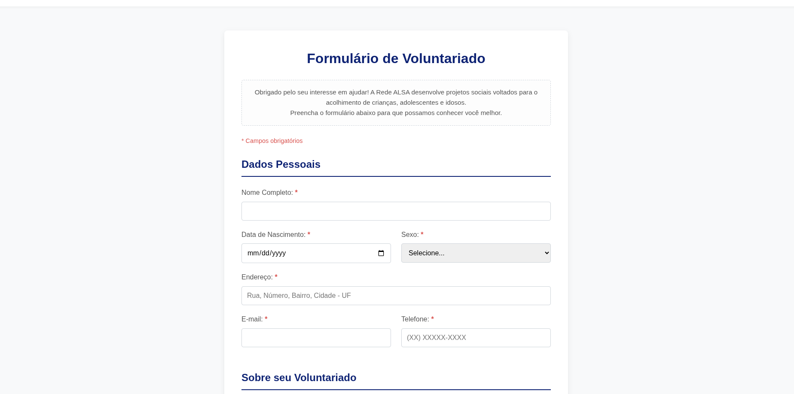
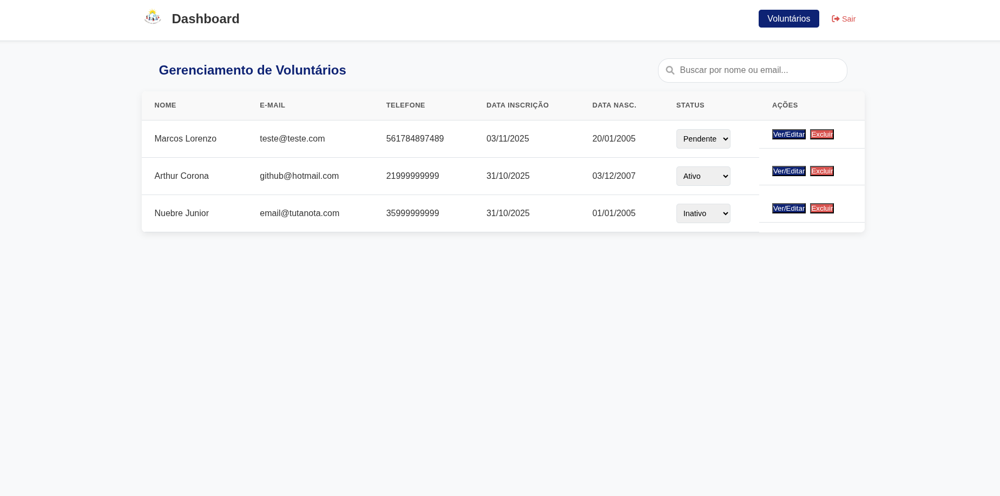

# ✨ Portal de Gerenciamento de Voluntários (Rede ALSA)


Projeto desenvolvido de forma pro-bono para a **Associação Lar Semente do Amor (Rede ALSA)**, com o objetivo de otimizar e digitalizar o processo de cadastro e gerenciamento de novos voluntários.

O sistema centraliza as informações em um dashboard administrativo, permitindo que os gestores da instituição aprovem, consultem e gerenciem os voluntários de forma eficiente, substituindo o processo manual anterior.

## 🚀 Principais Funcionalidades

O projeto é dividido em duas frentes principais:

### 1. Página Pública de Inscrição (`/index.html`)
* Formulário de cadastro completo para novos voluntários.
* Validação de dados em tempo real (ex: idade mínima +16 anos, campos obrigatórios) feita com JavaScript.
* Design limpo e responsivo, seguindo a identidade visual da instituição.

### 2. Dashboard Administrativo (`/volunteer-dashboard.html`)
* **Acesso Restrito:** Página protegida com sistema de login e senha (`/login.html`) via **Firebase Authentication**.
* **Proteção de Rotas:** Scripts de guarda (`auth-guard.js`) no lado do cliente e **Regras de Segurança** no lado do servidor (Firestore) garantem que apenas administradores autenticados possam ver ou modificar dados.
* **Visualização de Voluntários:** Tabela com todos os voluntários cadastrados, priorizada por status "Pendente" para facilitar a triagem.
* **Busca Rápida:** Filtro para encontrar voluntários por nome ou e-mail.
* **Gerenciamento (CRUD):**
    * **Editar:** Abertura de um modal para visualizar e editar **todas** as informações do voluntário.
    * **Mudar Status:** Alteração rápida do status (Pendente, Ativo, Inativo) diretamente na tabela.
    * **Excluir:** Remover um registro de voluntário.

---

## 🔧 Tecnologias Utilizadas

Este projeto foi construído com uma arquitetura "serverless" (BaaS), com o front-end consumindo diretamente os serviços do Google Firebase.

* **Front-end:** HTML5, CSS3, JavaScript (ES6 Modules)
* **Plataforma (BaaS):** Google Firebase
    * **Banco de Dados:** **Firestore** (para armazenamento NoSQL dos dados dos voluntários)
    * **Autenticação:** **Firebase Authentication** (para o login seguro dos administradores)
    * **Hosting:** **Firebase Hosting** (para deploy e hospedagem estática global)

---

## 💻 Como Rodar Localmente

1.  **Clone o repositório:**
    ```bash
    git clone [https://github.com/arthurcorona/sistema-voluntariado-ong.git](https://github.com/arthurcorona/sistema-voluntariado-ong.git)
    cd sistema-voluntariado-ong
    ```

2.  **Configure o Firebase:**
    * Crie seu próprio projeto no [Firebase](https://console.firebase.google.com/).
    * Ative o **Firestore** e o **Authentication** (com provedor de Email/Senha).
    * Vá em "Configurações do Projeto" > "Seus apps" > Web (`</>`).
    * Copie o objeto `firebaseConfig`.
    * Cole esse objeto dentro do arquivo `public/script/firebase-client.js`, substituindo o placeholder.

3.  **Crie suas Regras de Segurança:**
    * No Console do Firebase > Firestore > Regras, adicione:
    ```javascript
    rules_version = '2';
    service cloud.firestore {
      match /databases/{database}/documents {
        match /voluntarios/{voluntarioId} {
          allow create: if true; // Permite o formulário público
          allow read, update, delete: if request.auth != null; // Protege o dashboard
        }
      }
    }
    ```

4.  **Instale as Ferramentas do Firebase:**
    ```bash
    npm install -g firebase-tools
    ```

5.  **Rode o servidor de teste local:**
    ```bash
    firebase server
    ```
    O app estará rodando em `http://localhost:5000`.

---





---

## 👨‍💻 Autor

* **Arthur Corona**
* [LinkedIn](https://www.linkedin.com/in/arthur-corona-pimentel-32a155216/)
* [GitHub](https://github.com/arthurcorona)
